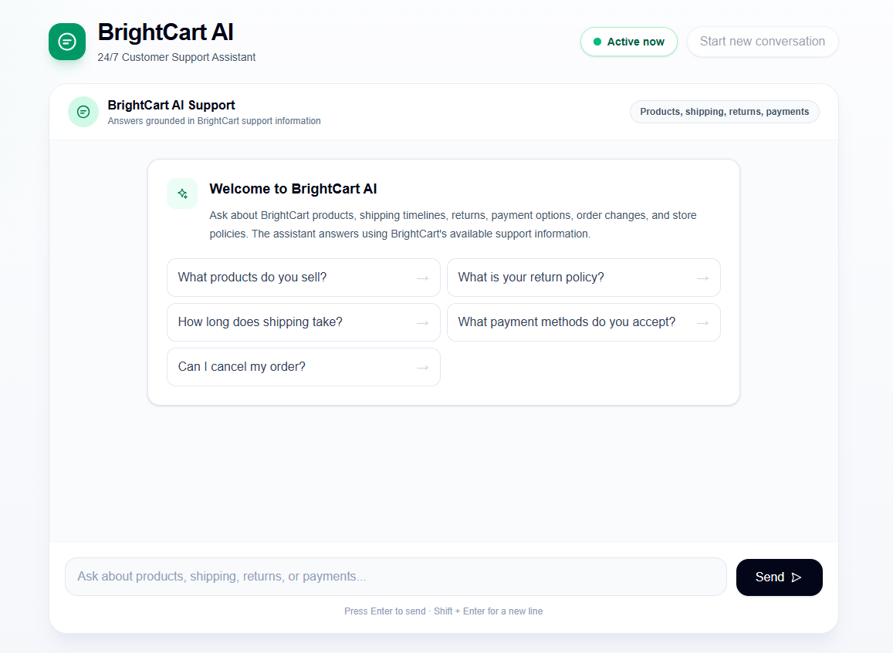
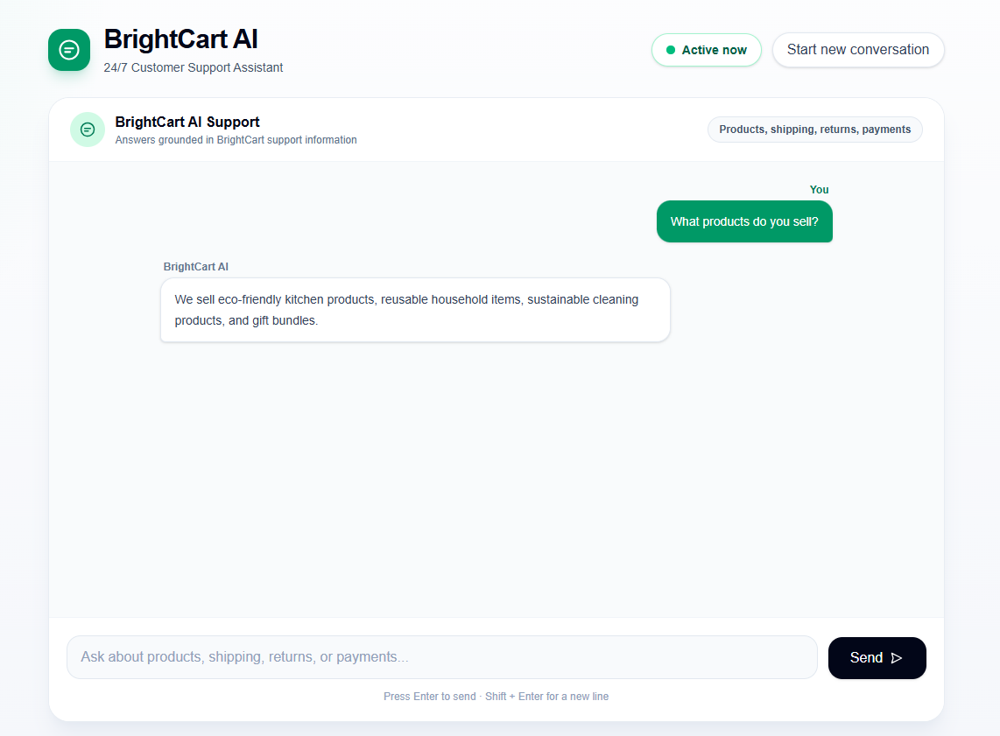
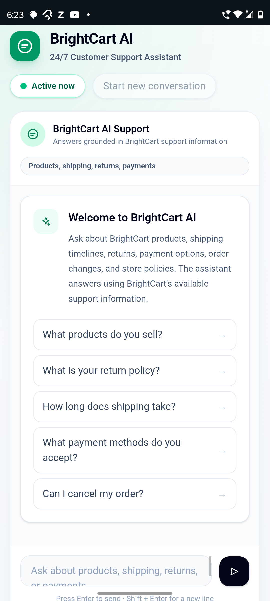
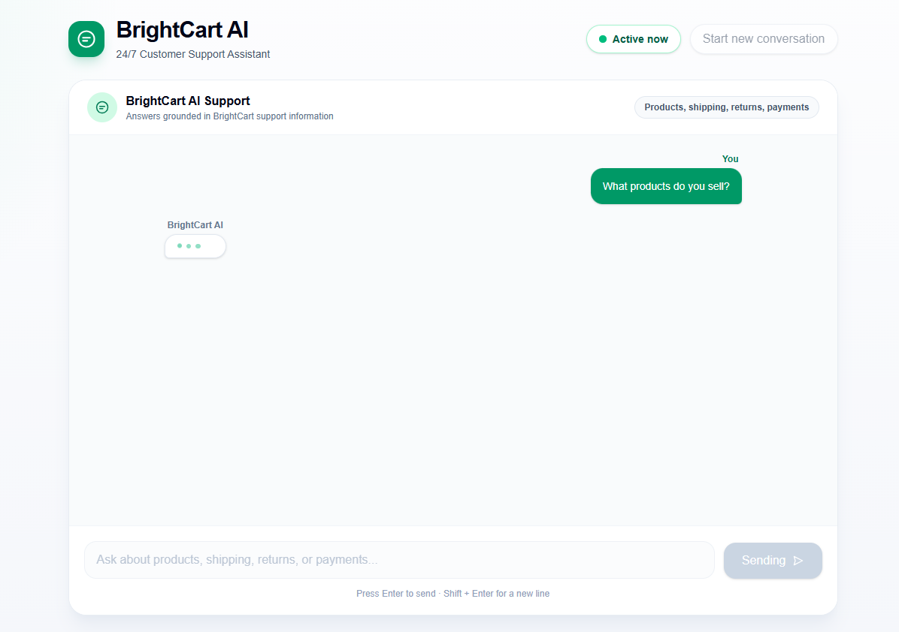
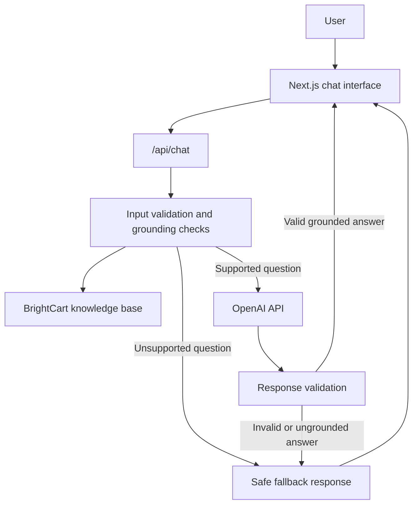

# BrightCart AI — Knowledge-Grounded Customer Support Chatbot

BrightCart AI is a responsive AI customer support assistant for e-commerce businesses, designed to answer customer questions using approved business knowledge.


## Live Demo

- Live demo: [https://ai-customer-support-chatbot-six.vercel.app/](https://ai-customer-support-chatbot-six.vercel.app/)
- Repository: [https://github.com/sayak-pandit/ai-customer-support-chatbot](https://github.com/sayak-pandit/ai-customer-support-chatbot)

## Application Preview

### Desktop Welcome Screen



### Desktop Conversation View



### Mobile Responsive View



### Typing Indicator



Screenshots show the deployed responsive interface across the main welcome, conversation, mobile, and loading states.

## Business Problem

Small and medium e-commerce businesses repeatedly answer customer questions about products, delivery, returns, payments, and store policies. Handling these questions manually increases support workload, delays responses, and can negatively affect the customer experience when customers need quick, consistent answers.

## Solution

BrightCart AI provides instant first-level customer support for a fictional e-commerce store. It answers using approved BrightCart business knowledge, reduces repetitive support work, provides safe fallback behavior for unsupported questions, and handles technical failures with professional user-facing messages.

The project can be adapted for another business by replacing the branding and knowledge-base content while preserving the grounding, validation, and fallback behavior.

## Key Features

- Knowledge-grounded customer support answers
- Strict fallback behavior for unsupported or out-of-scope questions
- Responsive SaaS-style chat interface
- Suggested starter questions
- Professional typing indicator
- Frontend and backend input validation
- Safe user-facing error messages
- Retry option after failed assistant responses
- Duplicate-submission prevention
- Mobile-responsive layout
- Accessible labels, status messaging, and interaction states
- Conversation reset control
- Server-side OpenAI API key protection
- Response validation before returning model output to the user

## Current Scope and Limitations

This demonstration is intentionally scoped as a portfolio MVP:

- Uses a fictional BrightCart knowledge base
- Does not access real customer orders
- Does not process refunds or cancellations
- Does not check live inventory
- Does not persist chat history after refresh
- Does not include authentication or a database
- Requires an OpenAI API key for local or deployed use

## Technology Stack

| Category | Technology |
| --- | --- |
| Framework | Next.js 16.2.9 App Router |
| Frontend | React 19.2.4, JavaScript |
| Styling | Tailwind CSS 4 |
| AI integration | OpenAI JavaScript SDK 6.44.0, OpenAI Responses API, `gpt-4.1-mini` |
| Deployment | Vercel-ready Next.js application |
| Validation and grounding | Local BrightCart knowledge base, deterministic topic checks, response validation |

## Architecture



The chat interface sends a customer question to the server-side API route. The API validates the request, checks whether the question is supported by the local BrightCart knowledge base, calls OpenAI only for supported topics, validates the model response, and returns either a grounded answer or the approved fallback message.

## Project Structure

```text
project/
|-- app/
|   |-- api/
|   |   `-- chat/
|   |       `-- route.js
|   |-- globals.css
|   |-- layout.js
|   `-- page.js
|-- data/
|   `-- knowledgeBase.js
|-- lib/
|   `-- grounding.js
|-- public/
|   `-- screenshots/
|       |-- desktop_conversation.png
|       |-- desktop_home_screen.png
|       |-- desktop_typing_indicator.png
|       `-- mobile_home_screen.png
|-- .env.example
|-- package.json
`-- README.md
```

## Local Setup

### Prerequisites

- Node.js installed
- npm installed
- OpenAI API key

### 1. Clone the Repository

```bash
git clone https://github.com/sayak-pandit/ai-customer-support-chatbot.git
```

### 2. Open the Project Directory

```bash
cd ai-customer-support-chatbot
```

If you are working from this local workspace, open:

```bash
cd project
```

### 3. Install Dependencies

```bash
npm install
```

### 4. Create the Local Environment File

Create a `.env.local` file in the project root:

```env
OPENAI_API_KEY=your_api_key_here
```

### 5. Start the Development Server

```bash
npm run dev
```

Open [http://localhost:3000](http://localhost:3000) in your browser.

## Environment Variables

```env
OPENAI_API_KEY=your_api_key_here
```

The `.env.local` file is for local development only and must not be committed. In production, configure the same variable through the hosting provider.

## Available Scripts

| Script | Command | Description |
| --- | --- | --- |
| Development | `npm run dev` | Starts the Next.js development server |
| Lint | `npm run lint` | Runs ESLint |
| Production build | `npm run build` | Creates a production build |
| Production start | `npm run start` | Starts the production server after building |

## Knowledge-Base Customization

To adapt BrightCart AI for another business:

- Update the business name, support email, products, pricing, delivery rules, returns, payments, and store policies in `data/knowledgeBase.js`.
- Update supported and unsupported topic terms in `lib/grounding.js` so the chatbot recognizes the new business domain correctly.
- Update UI branding, visible product/service language, and suggested questions in `app/page.js`.
- Update page metadata in `app/layout.js`.
- Review fallback wording in `lib/grounding.js` if the support contact or escalation path changes.

When changing the knowledge base, preserve the grounding and validation behavior. The assistant should continue to answer only from approved business information and use a safe fallback when the answer is not available.

## Deployment

BrightCart AI is ready to deploy on Vercel:

1. Push the repository to GitHub.
2. Sign in to [Vercel](https://vercel.com).
3. Import the GitHub repository into Vercel.
4. Confirm that Vercel detects the project as a Next.js application.
5. Add `OPENAI_API_KEY` in the Vercel project environment variables.
6. Deploy the project.
7. Test both a supported BrightCart question and an unsupported question on the live URL.

Changing environment variables in Vercel may require redeploying the application before the new values are used.

## Security and Privacy

- The OpenAI API key is used only in the server-side API route and is not exposed to browser code.
- `.env.local` should never be committed to the repository.
- Users should not submit sensitive personal, payment, or account information to this demo.
- A production application should add appropriate logging, monitoring, privacy policies, rate limiting, abuse protection, and operational review before handling real customer data.

## Verification

The project currently uses these quality checks:

- ESLint via `npm run lint`
- Production build validation via `npm run build`
- Manual responsive testing across desktop and mobile layouts
- Manual success, fallback, error, retry, and duplicate-submission behavior checks

Automated unit, integration, or end-to-end tests are not currently included.

## Freelance and Portfolio Use Case

This project demonstrates practical skills relevant to client-facing AI application work:

- AI API integration with server-side key protection
- Business-specific grounding and fallback behavior
- Professional frontend UX design
- Robust frontend and backend error handling
- Responsive development for desktop and mobile users
- Deployment-ready Next.js implementation
- Reusable customization path for other client businesses

## Future Improvements

Potential future enhancements include:

- External CMS or database-backed knowledge base
- Retrieval-augmented generation for larger support content
- Conversation persistence
- Authentication
- Multilingual support
- Customer-support handoff workflow
- Order-management integration
- Analytics and monitoring
- Automated test coverage
- Rate limiting and abuse protection

These are roadmap items and are not part of the current implementation.

## Author

Sayak Pandit
